# 创建npm账号

1. 在 npm 官网 [www.npmjs.com/](https://link.juejin.cn/?target=https%3A%2F%2Fwww.npmjs.com%2F) 注册并创建 npm 账号即可
2. 有时间可以进行2FA(双因素认证)，确保安全性

# 创建一个npm包

1.首先在git上创建一个新的repository,然后在本地克隆下来

2.进入到本地文件夹，打开终端，运行命令会初始化一些配置项，最后生成一个package.json文件。

```javascript
npm init
```

可以自定义一些配置：整个运行流程如下图：

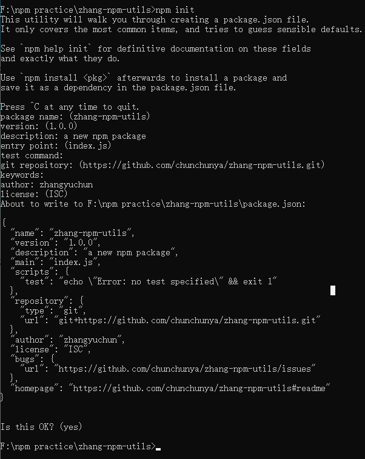

该项目入口文件默认index.js，在此，可以添加在项目文件夹根目录添加index.js文件，在index.js

写入要上传的相应代码，比如我要完成一个工具函数文件然后发布到npm上（此处涉及三个文件）。

index.js文件

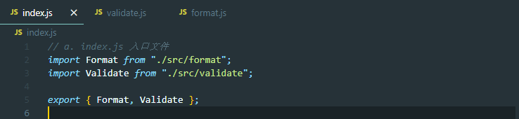

format.js文件

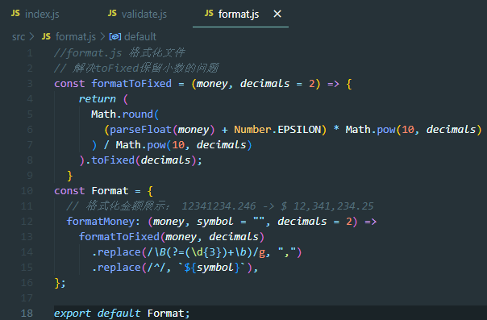

validate.js文件：

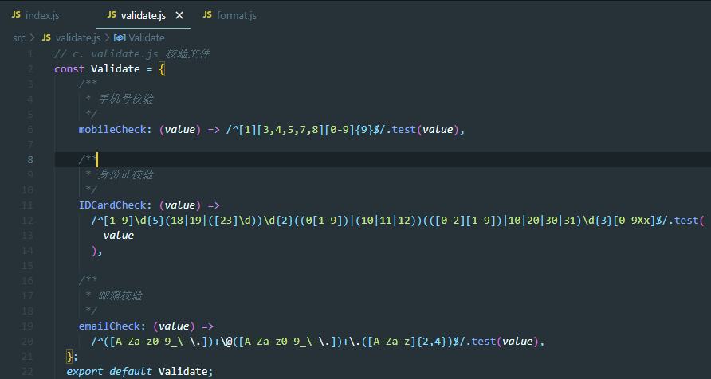

# npm包发布

1.首先检查npm源，是淘宝源或者公司的源要切回npm源，本人切换的方式使用nrm，具体流程如下：

```javascript
// 查看npm镜像源地址
npm config get registry
```

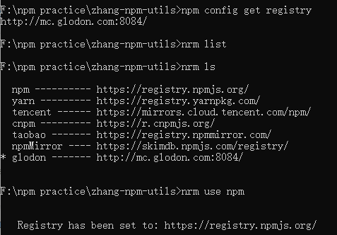

2.运行npm 的登陆命令，之后按照终端提示输入用户名、密码等信息即可（注意这里没有进行2FA,每次都需要利用邮箱发过来的码来进行验证，比较麻烦~）

```javascript
npm login
```

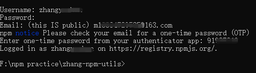

3.运行发布命令

```javascript
npm publish
```

发布成功截图如下：

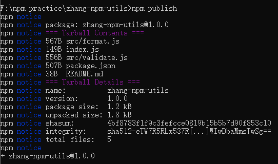

发布成功后可以登陆npm官网，查看发布包情况

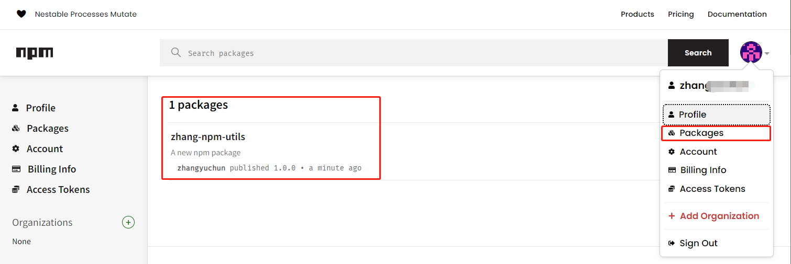

# npm包使用

1.这次可以在其他项目中安装上传的该依赖包

```JavaScript
npm install zhang-npm-utils
```

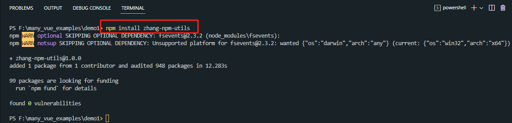

安装完后可以在项目的node_modules中看到包文件啦~

举例说明

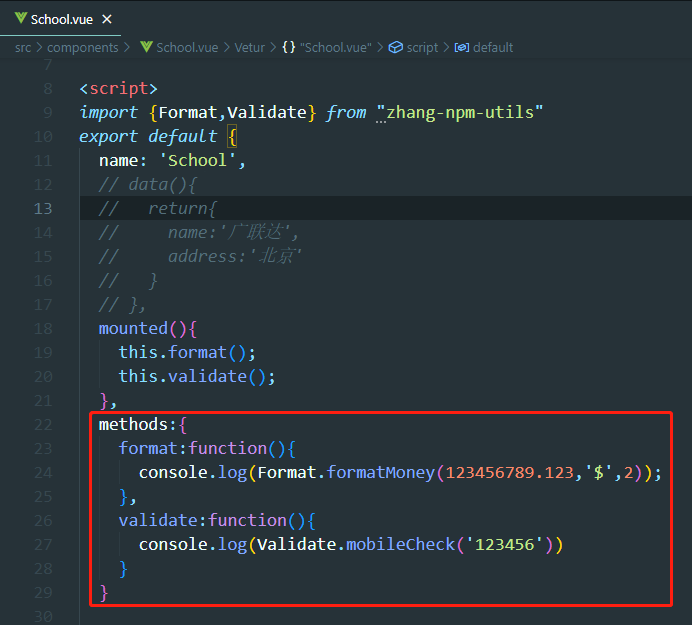

# npm包更新

将代码包改完后打开控制台，输入命令：

```javascript
npm version patch
```

会自动返回一个新的下一个小版本号！

再出入发布命令,即可更新已发布的npm包！

```javascript
npm publish
```

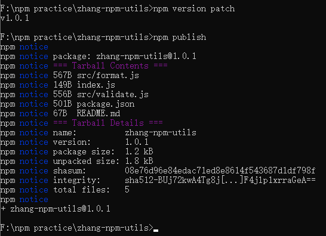

注意更新版本不同命令对应的版本要求：

```javascript
// patch：补丁号，修复bug，小变动，如 v1.0.0->v1.0.1
npm version patch

// minor：次版本号，增加新功能，如 v1.0.0->v1.1.0
npm version minor

// major：主版本号，不兼容的修改，如 v1.0.0->v2.0.0
npm version major
```

至此，整个流程就结束啦！！

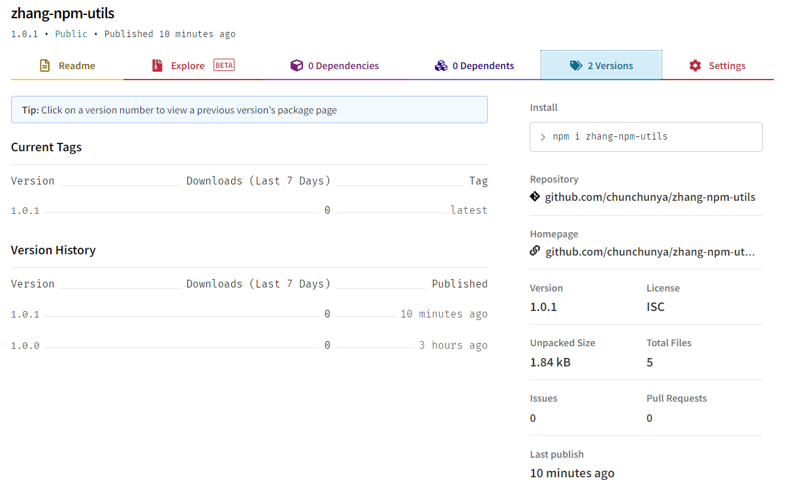