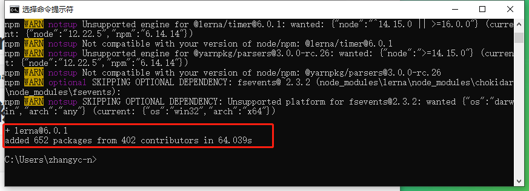
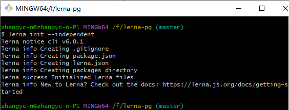
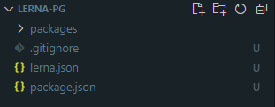
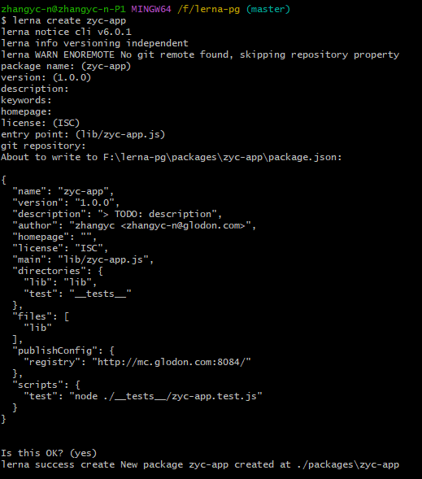
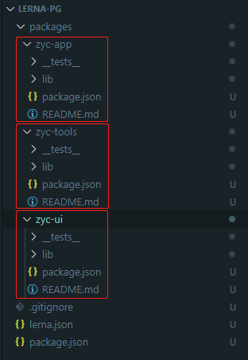
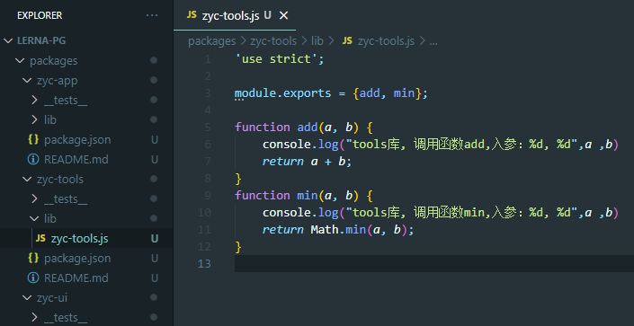
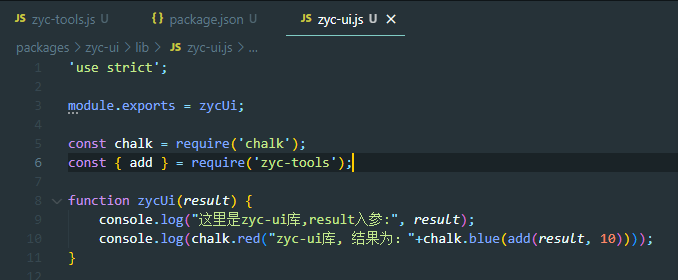
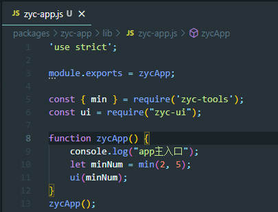

# 1.全局安装lerna

```javascript
npm install --global lerna
```

安装成功截图如下：



# 2.使用git init初始化一个项目仓库

```javascript
git init lerna-usage 
cd lerna-usage
```

# 3.执行lerna初始化

```javascript
lerna init  //固定/锁定模式（默认）
lerna init --independent  //独立模式
```

这里使用的是**独立模式**（这种模式允许使用者对每个package单独改变版本号。每次执行`lerna publish`的时候，针对所有有更新的package，会逐个询问需要升级的版本号，基准版本为它自身的package.json里面的版本号）

而**固定模式**通过`lerna.json`里的版本进行统一的版本管理。这种模式自动将所有packages包版本捆绑在一起，对任何其中一个或者多个packages进行重大改动都会导致所有packages的版本号进行升级。



目前文件夹目录如下：



假设有三个packages:

- zyc-app 模拟业务主项目，不需要发布npm包，依赖于zyc-ui和zyc-tools
- zyc-ui 模拟ui库项目，不需要发布npm包，依赖于zyc-tools
- zyc-tools 模拟工具共享库，需要发布npm包

# 4.创建三个新的package(zyc-app、zyc-ui、zyc-tools)

```javascript
lerna create zyc-app 
lerna create zyc-ui 
lerna create zyc-tools
```



创建后项目中的packages文件里多出了三个组件文件，整个文档目录结果如图所示。



# 5.添加依赖并编码

#### zyc-tools

在`packages/zyc-tools/lib/zyc-tools.js`添加代码如下



#### zyc-ui

**步骤一：**
为了防止其被发布到npm上，我们在其`package.json`中设置`"private": true`

**步骤二：**
添加第三方依赖包"chalk"到`zyc-ui`的开发依赖库中，执行如下命令：

```javascript
lerna add chalk --scope=zyc-ui --dev
```

**步骤三**
 添加本地包`zyc-tools`到`zyc-ui`的依赖库中，执行如下命令：

```javascript
lerna add zyc-tools --scope=zyc-ui
```

本地包添加的时候，lerna命令会通过symlink的方式关联过去，可以理解为创建了一个快捷方式，这个对本地开发非常有用。

**步骤四**
在`packages/zyc-ui/lib/zyc-ui.js`添加代码



##### zyc-app

**步骤一**
 为了防止其被发布到npm上，我们在其`package.json`中设置`"private"=true`。

**步骤二：**
 添加本地包`zyc-tools`到`zyc-app`的依赖库中，执行如下命令：

```javascript
lerna add zyc-tools --scope=zyc-app

```

**步骤三**
 添加本地包`zyc-ui`到`zyc-app`的依赖库中，执行如下命令：

```javascript
lerna add zyc-ui --scope=zyc-app
```

**步骤四** 在`packages/zyc-app/lib/zyc-app.js`添加代码



# 6、运行效果

由于此时已经安装好了所有依赖包，所以不需要执行`lerna bootstrap`， 如果是新clone的一个已有的lerna工程，可以通过执行`lerna bootstrap`命令一键安装所有packages的依赖项。
 此时运行如下命令：

```javascript
cd packages/zyc-app
node lib/zyc-app.js
```

运行结果如下（差一个截图）：

可看到三个package之间以及第三方依赖库之间的调用已经成功执行。发布到npm

# 7.执行发布命令

### 前置条件

- 如果是需要提前编译的项目，你可能需要通过`lerna run build`执行`build`命令生成打包。
- 发布之前，你需要保证相关代码都已经提交到git。
- 通过`lerna changed`查看有哪些更新的packages。
- 需要确保你的npm账号已经是登陆状态，否则可能发布失败。
- 保证你对需要发布的npm包具有相关发布权限。
- 在`lerna.json`中设置好正确的npm registry,比如`https://registry.npmjs.org/`。

当一切准备就绪后，就可以执行以下命令：

```javascript
lerna publish
```

此处根据我们选择的管理模式不同，提示问题可能有所不同。由于我们选择的是独立模式，所有packages的版本号都会根据`lerna.json`中的版本号进行更新。
 询问版本号界面如下：

选择了版本号的下一步界面如下：

我们可以看到三个packages的版本号都统一升级成了`0.1.2`，而且可以看到`zyc-app`和`zyc-ui`展示为`private`，说明不会被发布到npm。

### 执行结果

至此整个lerna使用流程完结撒花！！

